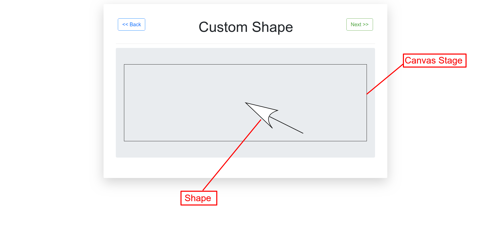

## About

### Brief
In this repo I play around with implementation of the JavaScript Canvas API using [Konva.js](https://konvajs.org). This is all to further my knowledge on the 2D context of the Canvas API. Amazing what you can do with JavaScript ; )

### Setup

Simply:
- Clone the repo 

```
git clone https://github.com/PeterKitonga/canvasapiplayground.git
```
- Navigate to the project and click on the `index.html` file

### Illustration


### Tutorial
Visit [Konvajs docs](https://konvajs.org/docs/index.html) for the documentation